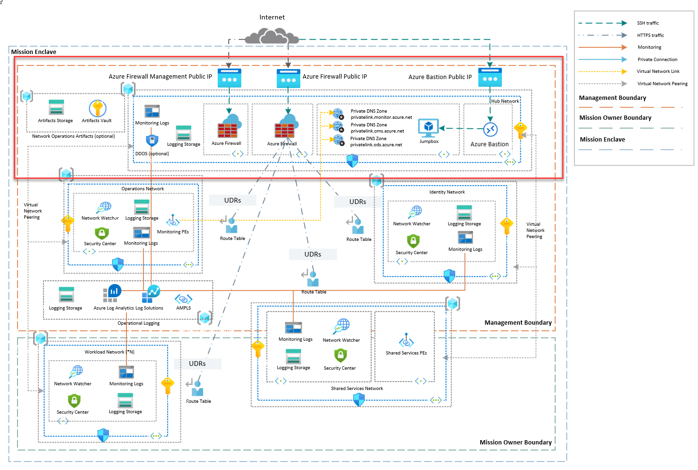

# Azure Virtual Network Management Hub with Firewall Terraform Module

[](CHANGELOG.md) [](NOTICE) [](LICENSE) [](https://registry.terraform.io/modules/azurenoops/overlays-management-hub/azurerm/)

This Overlay Terraform module deploys a management hub network using the [Microsoft recommended Hub-Spoke network topology](https://docs.microsoft.com/en-us/azure/architecture/reference-architectures/hybrid-networking/hub-spoke). Usually, only one hub in each region with multiple spokes and each of them can also be in separate subscriptions.

## SCCA Compliance

This module can be SCCA compliant and can be used in a SCCA compliant Network. Enable private endpoints and SCCA compliant network rules to make it SCCA compliant.

For more information, please read the [SCCA documentation]("https://www.cisa.gov/secure-cloud-computing-architecture").

## Contributing

If you want to contribute to this repository, feel free to to contribute to our Terraform module.

More details are available in the [CONTRIBUTING.md](./CONTRIBUTING.md#pull-request-process) file.

## Management Hub Architecture



## Resources Supported

* [Virtual Network](https://www.terraform.io/docs/providers/azurerm/r/virtual_network.html)
* [Subnets](https://www.terraform.io/docs/providers/azurerm/r/subnet.html)
* [Subnet Service Delegation](https://www.terraform.io/docs/providers/azurerm/r/subnet.html#delegation)
* [Virtual Network service endpoints](https://www.terraform.io/docs/providers/azurerm/r/subnet.html#service_endpoints)
* [Private Link service/Endpoint network policies on Subnet](https://www.terraform.io/docs/providers/azurerm/r/subnet.html#enforce_private_link_endpoint_network_policies)
* [AzureNetwork DDoS Protection Plan](https://www.terraform.io/docs/providers/azurerm/r/network_ddos_protection_plan.html)
* [Network Security Groups](https://www.terraform.io/docs/providers/azurerm/r/network_security_group.html)
* [Azure Firewall](https://www.terraform.io/docs/providers/azurerm/r/firewall.html)
* [Azure Firewall Application Rule Collection](https://www.terraform.io/docs/providers/azurerm/r/firewall_application_rule_collection.html)
* [Azure Firewall Network Rule Collection](https://www.terraform.io/docs/providers/azurerm/r/firewall_network_rule_collection.html)
* [Azure Firewall NAT Rule Collection](https://www.terraform.io/docs/providers/azurerm/r/firewall_nat_rule_collection.html)
* [Route Table](https://www.terraform.io/docs/providers/azurerm/r/route_table.html)
* [Role Assignment for Peering](https://www.terraform.io/docs/providers/azurerm/r/role_assignment.html)
* [Storage Account for Log Archive](https://www.terraform.io/docs/providers/azurerm/r/storage_account.html)
* [Log Analytics Workspace](https://www.terraform.io/docs/providers/azurerm/r/log_analytics_workspace.html)
* [Azure Monitoring Diagnostics](https://www.terraform.io/docs/providers/azurerm/r/monitor_diagnostic_setting.html)
* [Network Watcher](https://www.terraform.io/docs/providers/azurerm/r/network_watcher.html)
* [Network Watcher Workflow Logs](https://www.terraform.io/docs/providers/azurerm/r/network_watcher_flow_log.html)
* [Private DNS Zone](https://www.terraform.io/docs/providers/azurerm/r/private_dns_zone.html)

## Module Usage

```terraform
# Azurerm provider configuration
provider "azurerm" {
  features {}
}

```

## Hub Networking

Hub Networking is set up in a Management Hub design based on the SCCA Hub/Spoke architecture. The Management hub is a central point of connectivity to many different networks.

The Management hub contains the following resources:

* Virtual Network
* Subnets
* Subnet Service Delegation
* Virtual Network service endpoints
* Private Link service/Endpoint network policies on Subnet
* Azure Network DDoS Protection Plan
* Private DNS Zones
* Network Security Groups
* Azure Firewall
* Azure Firewall Application Rule Collection
* Azure Firewall Network Rule Collection

The following parameters affect Management Hub Networking.

Parameter name | Location | Default Value | Description
-------------- | ------------- | ------------- | -----------
`virtual_network_address_space` | `variables.vnet.tf` | '10.0.100.0/24' | The CIDR Virtual Network Address Prefix for the Hub Virtual Network.
`subnet_address_prefix` | `variables.snet.tf` | '10.0.100.128/27' | The CIDR Subnet Address Prefix for the default Hub subnet. It must be in the Hub Virtual Network space.
`firewall_client_snet_address_prefix` | `variables.fw.tf` | '10.0.100.0/26' | The CIDR Subnet Address Prefix for the Azure Firewall Subnet. It must be in the Hub Virtual Network space. It must be /26.
`firewall_management_snet_address_prefix` | `variables.fw.tf` | '10.0.100.64/26' | The CIDR Subnet Address Prefix for the Azure Firewall Management Subnet. It must be in the Hub Virtual Network space. It must be /26.

## Firewall

All network traffic is directed through the firewall residing in the Management Hub Network resource group. The firewall is configured as the default route for all other spokes including T0 (Identity and Authorization), T1 (Operations), T2 (Shared Services) Management Spokes and T3 (workload/team environments) workload spoke as follows:

|Name         |Address prefix| Next hop type| Next hop IP address|
|-------------|--------------|-----------------|-----------------|
|default_route| 0.0.0.0/0    |Virtual Appliance|10.0.100.4*       |

*-example IP for firewall

Force tunneling has to be enabled on the firewall to ensure all traffic is routed through the firewall. Also enabling this feature will ensure that the firewall is the default route for all the T0 through T3 Network routes.

The following parameters affect the firewall configuration for Force tunneling:

Parameter name | Location | Default Value | Description
-------------- | ------------- | ------------- | -----------
`enable_force_tunneling` | `variables.fw.tf` | true | Enable force tunneling on the firewall. This will ensure all traffic is routed through the firewall.

The default firewall configured for Management Hub Network is [Azure Firewall Premium](https://docs.microsoft.com/en-us/azure/firewall/premium-features).

Presently, there are two firewall rules configured to ensure access to the Azure Portal and to facilitate interactive logon via PowerShell and Azure CLI, all other traffic is restricted by default. Below are the collection of rules configured for Azure Commercial and Azure Government clouds:

|Rule Collection Priority | Rule Collection Name | Rule name | Source | Port     | Protocol                               |
|-------------------------|----------------------|-----------|--------|----------|----------------------------------------|
|100                      | AllowAzureCloud      | AzureCloud|*       |   *      |Any                                     |
|110                      | AzureAuth            | msftauth  |  *     | Https:443| aadcdn.msftauth.net, aadcdn.msauth.net |

## Optional Features

Management Hub has optional features that can be enabled by setting parameters on the deployment.

## Remote access with a Bastion Host

If you want to remotely access the network and the resources you've deployed you can use [Azure Bastion](https://docs.microsoft.com/en-us/azure/bastion/) to remotely access virtual machines within the network without exposing them via Public IP Addresses.

Deploy a Linux and Windows virtual machine as jumpboxes into the network without a Public IP Address using Azure Bastion Host by providing values for these parameters:

Parameter name | Default Value | Description
-------------- | ------------- | -----------
`deployRemoteAccess` | 'false' | When set to "true", provisions Azure Bastion Host and virtual machine jumpboxes. It defaults to "false".
`windowsVmAdminPassword` | new guid | The administrator password the Windows Virtual Machine to Azure Bastion remote into. It must be > 12 characters in length. See [password requirements for creating a Windows VM](https://docs.microsoft.com/en-us/azure/virtual-machines/windows/faq#what-are-the-password-requirements-when-creating-a-vm-).
`linuxVmAuthenticationType` | 'password' | [sshPublicKey/password] The authentication type for the Linux Virtual Machine to Azure Bastion remote into. It defaults to "password".
`linuxVmAdminPasswordOrKey` | new guid | The administrator password or public SSH key for the Linux Virtual Machine to Azure Bastion remote into. See [password requirements for creating a Linux VM](https://docs.microsoft.com/en-us/azure/virtual-machines/linux/faq#what-are-the-password-requirements-when-creating-a-vm-).
`windowsVmAdminUsername` | 'azureuser' | The administrator username for the Linux Virtual Machine to Azure Bastion remote into. It defaults to "azureuser".
`linuxVmAdminUsername` | 'azureuser' | The administrator username for the Linux Virtual Machine to Azure Bastion remote into. It defaults to "azureuser".

## Azure Firewall Premium

By default, Management Hub deploys **[Azure Firewall Premium](https://docs.microsoft.com/en-us/azure/firewall/premium-features). Not all regions support Azure Firewall Premium.** Check here to [see if the region you're deploying to supports Azure Firewall Premium](https://docs.microsoft.com/en-us/azure/firewall/premium-features#supported-regions). If necessary you can set a different firewall SKU or location.

You can manually specify which SKU of Azure Firewall to use for your deployment by specifying the `firewallSkuTier` parameter. This parameter only accepts values of `Standard` or `Premium`.

Parameter name | Default Value | Description
-------------- | ------------- | -----------
`firewallSkuTier` | 'Premium' | [Standard/Premium] The SKU for Azure Firewall. It defaults to "Premium".

If you'd like to specify a different region to deploy your resources into, change the location of the deployment. For example, when using the AZ CLI set the deployment command's `--location` argument.

## Recommended naming and tagging conventions

Using tags to properly organize your Azure resources, resource groups, and subscriptions into a taxonomy. Each tag is made up of a name and a value pair. For example, you can apply the term `Environment` and the value `Production` to all production resources.
See Resource name and tagging choice guide for advice on how to apply a tagging strategy.

>**Important** :
For operations, tag names are case-insensitive. A tag with a tag name is updated or retrieved, independent of casing. The resource provider, on the other hand, may preserve the casing you supply for the tag name. Cost reports will show that casing. **The case of tag values is important.**

An effective naming convention creates resource names by incorporating vital resource information into the name. A public IP resource for a production SharePoint workload, for example, is named `pip-sharepoint-prod-westus-001` using these [recommended naming conventions](https://docs.microsoft.com/en-us/azure/cloud-adoption-framework/ready/azure-best-practices/naming-and-tagging#example-names).

<!-- BEGIN_TF_DOCS -->
<!-- END_TF_DOCS -->

## Other resources

* [Terraform AzureRM Provider Documentation](https://www.terraform.io/docs/providers/azurerm/index.html)